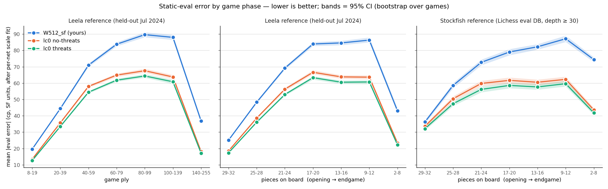

# Round H: Leela-trained threat net (bullet) + Coda-inspired search features

Idea source: the ideas behind [adamtwiss/coda](https://github.com/adamtwiss/coda) (GPL-3.0). Nothing is copied: every
feature is reimplemented in Quirky's own code with its own constants, as a switch that is off by default.

## Net: `weights/L1024T_lc0.nnue`

- **Inputs:** HalfKA with 16 king buckets (mirrored to files a-d), plus **threat features**: one input per
  (attacking piece, its square, attacked piece, its square), kings never victims, about 60k features. Threats are
  updated incrementally per move (only the attack pairs that change), not recomputed.
- **Layers:** feature transformer 1024 per side, pairwise product, then 32 -> 32 -> 1 with 8 piece-count output buckets.
- **Training:** [bullet](https://github.com/jw1912/bullet) on one GPU, six months of Leela test80 self-play
  (Jan-Jun 2024, Stockfish binpack format), 200 superbatches x 100M = 20B positions, about 8 h. Target =
  (1 - w) * sigmoid(Leela score) + w * game result, w rising 0.2 -> 0.4. Files: `training/bullet/` (input type in
  `examples_quirky/inputs.rs`, trainer `examples_quirky/main.rs`, converter to the engine format `lnn6.py`).
- **Engine format LNN6:** int16 feature transformer, int8 threat block, int8 first head layer with one scale per
  output, float rest. Build with `-DNNUE_LNN6`. Checked: engine features == trainer features, engine eval == trainer
  eval, incremental == full refresh.

### Strength (version G's search, against `W512_sf`, 8+0.08, UHO openings, 1 thread)

| net | games | Elo | nodes/s |
|---|---|---|---|
| **L1024T_lc0** (threats) | 1071 | **+34 +/- 17** | 450k |
| same recipe without threat inputs | 1092 | +22 +/- 16 | 670k |
| pilot, 4B positions | 1106 | -44 +/- 14 | |
| snapshot after 2B positions | 480 | -137 +/- 24 | |

Short training does not work: the full 20B-position run is what turns a -44 net into a +34 one.

### Where the nets make their errors

Static eval against two independent references: 268k quiet positions from **held-out** Leela games (July 2024,
never trained on) and 89k positions from the Lichess eval database (Stockfish depth >= 30). Each net's output is
rescaled by one fitted factor so unit conventions (Leela's Q-to-cp formula vs Stockfish's normalised cp) do not
count as error; a rank-based (monotone) calibration gives the same picture. Numbers in `results/phase_err/summary.txt`,
code in `training/net_phase_err.py`.

- All nets err most in the **late middlegame / early endgame** (9-20 pieces, ply 60-140) and least in the opening.
- The Leela nets cut the error by 20-25 cp there and **halve it in the deep endgame** (<= 8 pieces) - also against the
  Stockfish reference, which is the one that should favour the Stockfish-trained `W512_sf`.
- Threat inputs are a further 2-4 cp better, mostly in the middlegame.
- In engine units the Leela net's eval is about 1.15-1.5x larger than `W512_sf`'s, while the search margins were tuned
  for `W512_sf`: an eval-scale calibration is still to be tested.

## Search features (switches, all off by default)

Tested one at a time on version G with `W512_sf` (5+0.05 or 8+0.08, SPRT [0, 5]):

| switch | what it does | Elo vs G |
|---|---|---|
| `UseThreatHist` | quiet-move history indexed also by "from-square attacked" and "to-square attacked" | **+4.7 +/- 3.5** (accepted) |
| `UseCuckoo` | detects a repetition the opponent can force next move (cuckoo tables), scores it as a draw | **+3.9 +/- 3.0** (accepted) |
| `UseCorr5` | correction history from 5 keys: pawns, white/black non-pawns, continuation, transition | +1.1 +/- 2.4 (neutral) |
| `UseFhBlend` `UseTtBlend` `UseQsBlend` | at non-PV fail-highs return a value blended towards beta | -5.5 +/- 5.4 (rejected) |
| `UseCont6` + `UsePawnHist` | continuation history at plies 1/2/4/6, pawn-structure history | -26 +/- 10 (rejected; `UseHistNorm` does not rescue it) |
| `UseHindsight` | deepen/shorten a child after the parent's reduction turned out wrong | untested on G |

These are being re-tested on the Leela threat net, because their value can depend on the eval.
